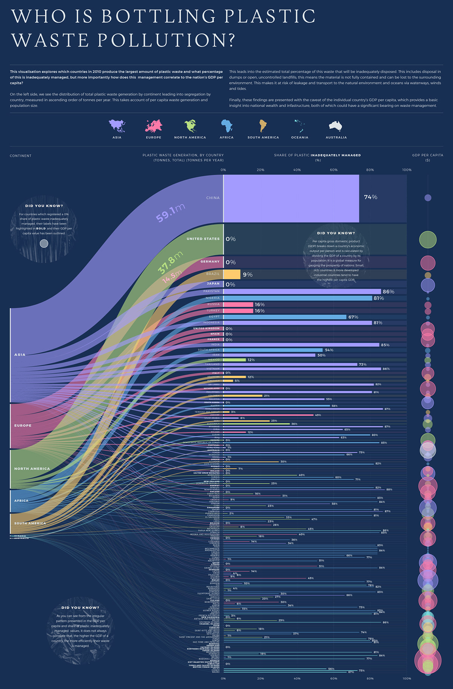
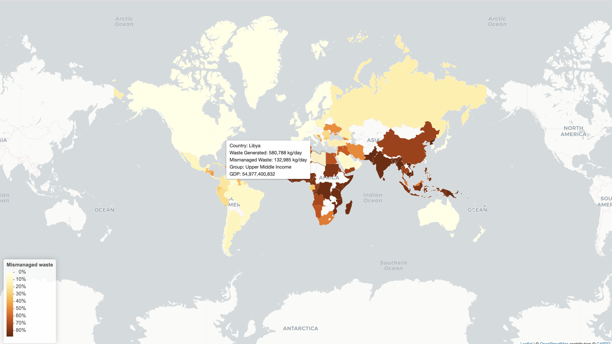

# Plastic & GDP Reconstruction ♻️

## Objective

This project visualizes the global connection between plastic waste and Gross Domestic Product (GDP), aiming to raise awareness among governments, waste management officials, and the public. This project originated from the inspiration of a visualization found on Behance ([Original Visualization](https://www.behance.net/gallery/106936329/Plastic-Waste-Pollution-data-visualisation) by J. Kettle). While recognizing the original visualization's merit, I identified some areas for improvement to better align with the visualisation's objective.

## RPubs Link

Link to detaled Web Report can be accessed [here](https://rpubs.com/ChrisJohn/1116784)

## Original Plot



## Identified Issues

### 1. Addressing a Practical Question
The original visualization infers that GDP is a good indicator of the amount of plastics being produced however this might not be the case as GDP is an indicator to the total economic output of a country not the current circumstances of the country. Therefore, it is better to compare based on a country’s classification group. On doing so we can infer that countries in lower income group categories generally tend to have higher mismanaged waste.

### 2. Ensuring Data Integrity
A lot of data has been lost as the source document has a unconventional naming system for countries (Eg: Faeroe Islands is misnamed as Faroe Islands), all such observations turn out to become NA values in this visual and it is very hard to identify these NA values (improper representation) in this Sankey Diagram.

### 3. Perceptual Clarity
There is a visual overload of information due to high number of observations that need to be addressed. The overlapping circles indicating the GDP cannot be easily perceived by the viewer and as the width of the observations decreases it is hard to compare observations make it hard to generate an actionable insight. The element coding such as text (bolded/unbolded), circle outline (bolded/unbolded) create a bombardment of visual elements to focus on for the viewer.

## Recontructed Visualization



## References

- [Original Visualization](https://www.behance.net/gallery/106936329/Plastic-Waste-Pollution-data-visualisation) by J. Kettle
- [Plastic Waste Data](https://doi.org/10.1126/science.1260352) from Jambeck et al.
- [GDP Data](https://ourworldindata.org/grapher/gross-domestic-product?time=2011) from Our World in Data
- [Continents Data](https://ourworldindata.org/grapher/continents-according-to-our-world-in-data) from Our World in Data

## Project Speifications

### Data Preparation

- Raw Data Import: Utilize the `tidyverse` library to import plastic waste, continents, and GDP data.
- Data Cleaning: Address issues like unconventional country names, NA values, and data format inconsistencies.
- Data Preprocessing: Merge relevant datasets, filter unnecessary data, and format variables for analysis.

### Visualization

- Geospatial Plot: Utilize the `leaflet` library to create an interactive geospatial plot.
- Color Mapping: Implement color scales to represent the percentage of inadequately managed waste.
- Tooltips: Provide informative tooltips for each country, detailing waste generation, economic status, and GDP.

### Finalization

- Legend: Included a legend for clarity on color representation.
- Readability Enhancement: Acknowledged the original visualization's strengths while proposing improvements for better readability.

## Usage Instructions

1. **Clone the Repository:**
   ```bash
   git clone https://github.com/Git-With-Chris/GlobalPlasticPulse.git
   ```
2. **Data Import:** Ensure all necessary data files are in the specified directory.
3. **Library Installation:** Install required R libraries using `install.packages("library_name")`.
4. **Run Script:** Execute the R script to preprocess data and generate the visualization.


## Project Structure

```plaintext

.
├── GlobalPlasticPulse.R
├── README.md
├── WebReport.Rmd
├── WebReport.html
├── data
│   ├── 2010GDP.csv
│   ├── continents-according-to-our-world-in-data.csv
│   ├── newplastics.csv
│   ├── world-administrative-boundaries
│   │   ├── world-administrative-boundaries.dbf
│   │   ├── world-administrative-boundaries.prj
│   │   ├── world-administrative-boundaries.shp
│   │   └── world-administrative-boundaries.shx
│   └── ~$wplastics.csv
└── images
    ├── OriginalVisual.jpg
    └── ReconstructedVisual.png

4 directories, 14 files

```

## Notes

- The original visualization is commendable, but there is room for improvement in terms of readability.
- Continuous improvement is encouraged based on feedback and evolving data.

Feel free to customize and enhance the project as needed. Contributions and suggestions are welcome!
